# Diagrama ER — Amparo

```mermaid
erDiagram
    User {
        string id PK
        string email UK
        string password
        string name
        enum   role "USER | ADMIN | VICTIM"
        string cpf "encrypted, nullable"
        string cpfHash UK "sha256, nullable"
        datetime createdAt
        datetime updatedAt
    }

    Aggressor {
        string id PK
        string name
        string cpf "encrypted"
        string cpfHash UK "sha256"
    }

    Occurrence {
        string   id PK
        string   description
        float    latitude
        float    longitude
        string   userId FK
        string   aggressorId FK "nullable"
        datetime createdAt
        datetime updatedAt
    }

    EmergencyContact {
        string   id PK
        string   name
        string   phone "encrypted"
        string   email "encrypted, nullable"
        string   relationship
        int      priority
        string   userId FK
        datetime createdAt
        datetime updatedAt
    }

    EmergencyAlert {
        string   id PK
        float    latitude
        float    longitude
        string   address "nullable"
        string   status "PENDING | ACTIVE | CLOSED | CANCELLED"
        string   cancellationReason "nullable"
        string   userId FK "nullable"
        datetime createdAt
    }

    NotificationLog {
        string   id PK
        string   alertId FK
        string   contactEmail "nullable"
        string   contactName
        string   channel "EMAIL | PUSH"
        string   status "SENT | FAILED"
        string   errorMessage "nullable"
        int      attempt
        datetime createdAt
    }

    AlertEvent {
        string   id PK
        string   alertId FK
        enum     type "LOCATION_UPDATE | NOTIFICATION_SENT | STATUS_CHANGE | COMMENT | CREATED"
        enum     source "SYSTEM | ADMIN | USER"
        string   message
        string   metadata "nullable, JSON"
        datetime createdAt
    }

    CheckIn {
        string   id PK
        datetime startTime
        datetime expectedArrivalTime
        datetime actualArrivalTime "nullable"
        float    startLatitude "nullable"
        float    startLongitude "nullable"
        float    finalLatitude "nullable"
        float    finalLongitude "nullable"
        string   distanceType "SHORT | MEDIUM | LONG"
        string   status "ACTIVE | ON_TIME | LATE | CANCELLED"
        string   userId FK
        datetime overdueAt "nullable"
        int      escalationStage "0=nenhum 1=in-app 2=email P1 3=email P2/P3 4=critico"
        datetime createdAt
        datetime updatedAt
    }

    CheckInSchedule {
        string   id PK
        string   userId FK
        string   name
        string   destinationAddress "nullable"
        float    destinationLat
        float    destinationLng
        datetime expectedArrivalAt
        int      windowMinutes "tolerancia em minutos, default 15"
        string   status "PENDING | ARRIVED | ALERTED | CANCELLED"
        datetime alertedAt "nullable"
        datetime arrivedAt "nullable"
        datetime createdAt
        datetime updatedAt
    }

    SafeLocation {
        string   id PK
        string   name
        string   address "nullable"
        float    latitude
        float    longitude
        int      radius "metros, default 200"
        string   userId FK
        datetime createdAt
        datetime updatedAt
    }

    Notification {
        string   id PK
        string   title
        string   body
        enum     category "ALERT | SUCCESS | WARNING | INFO | MAINTENANCE"
        string   targetId FK "nullable, null = broadcast"
        boolean  read
        datetime createdAt
    }

    Note {
        string   id PK
        string   title "nullable"
        string   content
        string   userId FK
        string   occurrenceId FK "nullable"
        datetime createdAt
        datetime updatedAt
    }

    Document {
        string   id PK
        string   fileName
        string   contentType
        string   storageKey UK
        int      sizeBytes "nullable"
        string   userId FK
        string   uploadedBy "nullable, admin id"
        datetime createdAt
        datetime updatedAt
    }

    AuditLog {
        string   id PK
        string   userId "nullable"
        string   action
        string   resource
        string   resourceId "nullable"
        string   ipAddress "nullable"
        datetime createdAt
    }

    HeatMapCell {
        string   id PK
        string   cellKey UK "geohash ou tile index"
        float    latitude UK
        float    longitude UK
        int      intensity "contagem de ocorrencias"
        float    riskScore "score ponderado por tipo de ocorrencia"
        datetime lastOccurrence
        datetime updatedAt
    }

    PatrolRoute {
        string   id PK
        string   name
        string   waypoints "JSON: Array<{ latitude, longitude, order, riskScore }>"
        string   routeGeometry "nullable, JSON: Array<[lng, lat]> via OSRM"
        enum     status "PENDING | IN_PROGRESS | COMPLETED | CANCELLED"
        string   assignedTo "nullable, agente/viatura"
        string   generatedBy "nullable, admin id"
        datetime scheduledAt "nullable"
        datetime startedAt "nullable"
        datetime completedAt "nullable"
        datetime createdAt
        datetime updatedAt
    }

    PatrolRouteLog {
        string   id PK
        string   patrolRouteId FK
        string   event "GENERATED | ASSIGNED | STARTED | COMPLETED | CANCELLED | UPDATED"
        string   performedBy "nullable, userId"
        string   metadata "nullable, JSON"
        datetime createdAt
    }

    %% Relacionamentos
    User ||--o{ Occurrence         : "registra"
    User ||--o{ EmergencyContact   : "possui"
    User ||--o{ EmergencyAlert     : "aciona"
    User ||--o{ CheckIn            : "realiza"
    User ||--o{ CheckInSchedule    : "agenda"
    User ||--o{ SafeLocation       : "cadastra"
    User ||--o{ Notification       : "recebe"
    User ||--o{ Note               : "escreve"
    User ||--o{ Document           : "armazena"

    Aggressor ||--o{ Occurrence    : "vinculado a"

    Occurrence ||--o{ Note         : "tem"

    EmergencyAlert ||--o{ NotificationLog : "gera"
    EmergencyAlert ||--o{ AlertEvent      : "registra"

    PatrolRoute ||--o{ PatrolRouteLog : "registra"
```

## Índices notáveis

| Tabela | Índice | Finalidade |
|---|---|---|
| `CheckIn` | `[userId, status]` | Check-in ativo por usuário |
| `CheckIn` | `[status, expectedArrivalTime]` | Cron de check-ins vencidos |
| `CheckIn` | `[status, escalationStage, overdueAt]` | Escalonamento progressivo |
| `CheckIn` | `[userId, createdAt]` | Histórico de check-ins |
| `CheckInSchedule` | `[status, expectedArrivalAt]` | Cron de monitoramento de destinos |
| `EmergencyAlert` | `[status, createdAt]` | Listagem do dashboard |
| `AlertEvent` | `[alertId, createdAt]` | Timeline de eventos |
| `NotificationLog` | `[alertId, createdAt]` | Logs de entrega por alerta |
| `Notification` | `[targetId, createdAt]` | Notificações por usuário |
| `Note` | `[userId, createdAt]` | Notas por usuário |
| `Document` | `[userId, createdAt]` | Documentos por usuário |
| `HeatMapCell` | `[latitude, longitude]` UK | Uma célula por coordenada |
| `PatrolRoute` | `[status]`, `[scheduledAt]` | Rotas por estado e agenda |
| `PatrolRouteLog` | `[patrolRouteId]`, `[event]` | Logs de rota por evento |
