# Diagrama ER — Amparo

> Gerado em 2026-03-21 | Branch: AM-137

```mermaid
erDiagram
    User {
        string id PK
        string email UK
        string password
        string name
        enum   role "USER | ADMIN | VICTIM"
        string cpf "encrypted"
        string cpfHash UK "sha256"
        datetime createdAt
        datetime updatedAt
    }

    Aggressor {
        string id PK
        string name
        string cpf "encrypted"
        string cpfHash UK "sha256"
    }

    Occurrence {
        string   id PK
        string   description
        float    latitude
        float    longitude
        string   userId FK
        string   aggressorId FK "nullable"
        datetime createdAt
        datetime updatedAt
    }

    EmergencyContact {
        string   id PK
        string   name
        string   phone "encrypted"
        string   email "encrypted, nullable"
        string   relationship
        int      priority
        string   userId FK
        datetime createdAt
        datetime updatedAt
    }

    EmergencyAlert {
        string   id PK
        float    latitude
        float    longitude
        string   address "nullable"
        string   status "PENDING | ACTIVE | CLOSED"
        string   userId FK "nullable"
        datetime createdAt
    }

    NotificationLog {
        string   id PK
        string   alertId FK
        string   contactEmail "nullable"
        string   contactName
        string   channel "EMAIL | PUSH"
        string   status "SENT | FAILED"
        string   errorMessage "nullable"
        int      attempt
        datetime createdAt
    }

    AlertEvent {
        string   id PK
        string   alertId FK
        enum     type "LOCATION_UPDATE | NOTIFICATION_SENT | STATUS_CHANGE | COMMENT | CREATED"
        enum     source "SYSTEM | ADMIN | USER"
        string   message
        string   metadata "nullable, JSON"
        datetime createdAt
    }

    CheckIn {
        string   id PK
        datetime startTime
        datetime expectedArrivalTime
        datetime actualArrivalTime "nullable"
        float    startLatitude "nullable"
        float    startLongitude "nullable"
        float    finalLatitude "nullable"
        float    finalLongitude "nullable"
        string   distanceType "SHORT | MEDIUM | LONG"
        string   status "ACTIVE | ON_TIME | LATE | CANCELLED"
        string   userId FK
        datetime createdAt
        datetime updatedAt
    }

    SafeLocation {
        string   id PK
        string   name
        string   address "nullable"
        float    latitude
        float    longitude
        int      radius "metros, default 200"
        string   userId FK
        datetime createdAt
        datetime updatedAt
    }

    Notification {
        string   id PK
        string   title
        string   body
        enum     category "ALERT | SUCCESS | WARNING | INFO | MAINTENANCE"
        string   targetId FK "nullable, null = broadcast"
        boolean  read
        datetime createdAt
    }

    Note {
        string   id PK
        string   title "nullable"
        string   content
        string   userId FK
        string   occurrenceId FK "nullable"
        datetime createdAt
        datetime updatedAt
    }

    Document {
        string   id PK
        string   fileName
        string   contentType
        string   storageKey UK
        int      sizeBytes "nullable"
        string   userId FK
        string   uploadedBy "nullable, admin id"
        datetime createdAt
        datetime updatedAt
    }

    AuditLog {
        string   id PK
        string   userId "nullable"
        string   action
        string   resource
        string   resourceId "nullable"
        string   ipAddress "nullable"
        datetime createdAt
    }

    HeatMapCell {
        string   id PK
        float    latitude UK
        float    longitude UK
        int      intensity "contagem de ocorrencias"
        datetime lastOccurrence
        datetime updatedAt
    }

    PatrolRoute {
        string   id PK
        string   name
        string   waypoints "JSON array de coordenadas"
        enum     status "PENDING | IN_PROGRESS | COMPLETED | CANCELLED"
        string   assignedTo "nullable, agente/viatura"
        string   generatedBy "nullable, admin id"
        datetime scheduledAt "nullable"
        datetime startedAt "nullable"
        datetime completedAt "nullable"
        datetime createdAt
        datetime updatedAt
    }

    %% Relacionamentos
    User ||--o{ Occurrence         : "registra"
    User ||--o{ EmergencyContact   : "possui"
    User ||--o{ EmergencyAlert     : "aciona"
    User ||--o{ CheckIn            : "realiza"
    User ||--o{ SafeLocation       : "cadastra"
    User ||--o{ Notification       : "recebe"
    User ||--o{ Note               : "escreve"
    User ||--o{ Document           : "armazena"

    Aggressor ||--o{ Occurrence    : "vinculado a"

    Occurrence ||--o{ Note         : "tem"

    EmergencyAlert ||--o{ NotificationLog : "gera"
    EmergencyAlert ||--o{ AlertEvent      : "registra"
```

## Indices notaveis

| Tabela | Indice | Finalidade |
|---|---|---|
| `CheckIn` | `[userId, status]` | Check-in ativo por usuario |
| `CheckIn` | `[status, expectedArrivalTime]` | Cron de check-ins vencidos |
| `CheckIn` | `[userId, createdAt]` | Historico de check-ins |
| `EmergencyAlert` | `[status, createdAt]` | Listagem do dashboard |
| `AlertEvent` | `[alertId, createdAt]` | Timeline de eventos |
| `NotificationLog` | `[alertId, createdAt]` | Logs de entrega por alerta |
| `Notification` | `[targetId, createdAt]` | Notificacoes por usuario |
| `Note` | `[userId, createdAt]` | Notas por usuario |
| `Document` | `[userId, createdAt]` | Documentos por usuario |
| `HeatMapCell` | `[latitude, longitude]` UK | Uma celula por coordenada |
| `PatrolRoute` | `[status]`, `[scheduledAt]` | Rotas por estado e agenda |

## Entidades futuras (esbocos — sem use-cases implementados)

- **`SafeLocation`** — locais seguros da vitima para geofencing (RN06)
- **`HeatMapCell`** — celulas agregadas do mapa de calor para RF02
- **`PatrolRoute`** — rotas de patrulhamento para RF06
