# Modelo Conceitual — Amparo

O modelo conceitual representa as entidades do negócio e seus relacionamentos em linguagem natural, sem detalhes técnicos de implementação.

---

## Diagrama

```mermaid
erDiagram
    USUARIO {
        identificador id
        nome nome
        perfil perfil
    }

    AGRESSOR {
        identificador id
        nome nome
    }

    OCORRENCIA {
        identificador id
        descricao descricao
        localizacao localizacao
        data data
    }

    CONTATO_EMERGENCIA {
        identificador id
        nome nome
        telefone telefone
        parentesco parentesco
        prioridade prioridade
    }

    ALERTA_EMERGENCIA {
        identificador id
        localizacao localizacao
        status status
        data data
    }

    LOG_NOTIFICACAO {
        identificador id
        canal canal
        status status
    }

    EVENTO_ALERTA {
        identificador id
        tipo tipo
        mensagem mensagem
    }

    CHECKIN {
        identificador id
        horario_partida horario_partida
        horario_previsto horario_previsto
        status status
    }

    AGENDA_CHECKIN {
        identificador id
        nome nome
        destino destino
        horario_previsto horario_previsto
        status status
    }

    LOCAL_SEGURO {
        identificador id
        nome nome
        localizacao localizacao
        raio raio
    }

    NOTIFICACAO {
        identificador id
        titulo titulo
        categoria categoria
    }

    NOTA {
        identificador id
        titulo titulo
        conteudo conteudo
    }

    DOCUMENTO {
        identificador id
        nome_arquivo nome_arquivo
        tipo tipo
    }

    LOG_AUDITORIA {
        identificador id
        acao acao
        recurso recurso
    }

    CELULA_MAPA_CALOR {
        identificador id
        localizacao localizacao
        intensidade intensidade
        risco risco
    }

    ROTA_PATRULHA {
        identificador id
        nome nome
        pontos_passagem pontos_passagem
        status status
    }

    LOG_ROTA_PATRULHA {
        identificador id
        evento evento
    }

    %% Um usuário pode registrar várias ocorrências
    USUARIO ||--o{ OCORRENCIA         : "registra"

    %% Um usuário possui vários contatos de emergência
    USUARIO ||--o{ CONTATO_EMERGENCIA : "possui"

    %% Um usuário pode acionar vários alertas
    USUARIO ||--o{ ALERTA_EMERGENCIA  : "aciona"

    %% Um usuário realiza vários check-ins de trajeto
    USUARIO ||--o{ CHECKIN            : "realiza"

    %% Um usuário agenda vários check-ins de destino
    USUARIO ||--o{ AGENDA_CHECKIN     : "agenda"

    %% Um usuário cadastra vários locais seguros
    USUARIO ||--o{ LOCAL_SEGURO       : "cadastra"

    %% Um usuário recebe várias notificações
    USUARIO ||--o{ NOTIFICACAO        : "recebe"

    %% Um usuário escreve várias notas
    USUARIO ||--o{ NOTA               : "escreve"

    %% Um usuário armazena vários documentos
    USUARIO ||--o{ DOCUMENTO          : "armazena"

    %% Um agressor pode estar vinculado a várias ocorrências
    AGRESSOR ||--o{ OCORRENCIA        : "identificado em"

    %% Uma ocorrência pode ter várias notas associadas
    OCORRENCIA ||--o{ NOTA            : "possui"

    %% Um alerta gera vários logs de notificação
    ALERTA_EMERGENCIA ||--o{ LOG_NOTIFICACAO  : "gera"

    %% Um alerta registra vários eventos em sua timeline
    ALERTA_EMERGENCIA ||--o{ EVENTO_ALERTA   : "registra"

    %% Uma rota de patrulha registra vários logs de execução
    ROTA_PATRULHA ||--o{ LOG_ROTA_PATRULHA  : "registra"
```

---

## Descrição das Entidades

| Entidade | Descrição |
|---|---|
| **USUARIO** | Pessoa que utiliza o sistema. Pode ser vítima, administrador ou usuário comum. |
| **AGRESSOR** | Pessoa identificada como autora de violência em uma ocorrência. |
| **OCORRENCIA** | Registro de um incidente de violência com localização e descrição. |
| **CONTATO_EMERGENCIA** | Pessoa de confiança da vítima a ser notificada em situações de risco. |
| **ALERTA_EMERGENCIA** | Sinal de socorro acionado pela vítima, com localização em tempo real. |
| **LOG_NOTIFICACAO** | Registro do envio (ou falha) de uma notificação aos contatos de emergência. |
| **EVENTO_ALERTA** | Evento ocorrido na linha do tempo de um alerta (criação, atualização de local, cancelamento, etc.). |
| **CHECKIN** | Monitoramento de um trajeto com horário previsto de chegada. |
| **AGENDA_CHECKIN** | Destino programado com tolerância de tempo, que dispara alerta automático se não confirmado. |
| **LOCAL_SEGURO** | Local cadastrado pela vítima como zona segura para geofencing. |
| **NOTIFICACAO** | Mensagem do sistema enviada a um usuário específico ou a todos. |
| **NOTA** | Texto livre escrito pela vítima, podendo estar vinculado a uma ocorrência. |
| **DOCUMENTO** | Arquivo enviado pela vítima ou por um administrador (ex: boletim de ocorrência, foto). |
| **LOG_AUDITORIA** | Registro de ações realizadas no sistema para fins de rastreabilidade. |
| **CELULA_MAPA_CALOR** | Unidade geográfica agregada com contagem de ocorrências e score de risco. |
| **ROTA_PATRULHA** | Rota de patrulhamento gerada para agentes de segurança com base no mapa de calor. |
| **LOG_ROTA_PATRULHA** | Registro de eventos de execução de uma rota (geração, início, conclusão, etc.). |

---

## Regras de Negócio Refletidas no Modelo

| Regra | Entidade(s) Envolvida(s) |
|---|---|
| Uma vítima pode registrar ocorrências com ou sem agressor identificado | OCORRENCIA → AGRESSOR (opcional) |
| Um alerta dispara notificações automáticas para os contatos da vítima | ALERTA_EMERGENCIA → LOG_NOTIFICACAO |
| Check-ins de destino disparam alertas automaticamente ao vencer o prazo | AGENDA_CHECKIN → ALERTA_EMERGENCIA |
| Check-ins de trajeto possuem escalonamento progressivo de alertas | CHECKIN |
| Rotas de patrulha são geradas a partir do mapa de calor de ocorrências | CELULA_MAPA_CALOR → ROTA_PATRULHA |
| Notas podem ser vinculadas a uma ocorrência ou ser de uso livre | NOTA → OCORRENCIA (opcional) |
| Notificações podem ser direcionadas a um usuário ou transmitidas a todos | NOTIFICACAO → USUARIO (opcional) |
