# Modelo Lógico — Amparo

O modelo lógico define a estrutura relacional com atributos, tipos genéricos, chaves primárias (PK), chaves estrangeiras (FK) e restrições, sem depender de um banco de dados específico.

---

## Diagrama

```mermaid
erDiagram
    User {
        UUID    id           PK
        TEXT    email        UK "NOT NULL"
        TEXT    password     "NOT NULL"
        TEXT    name         "NOT NULL"
        TEXT    role         "NOT NULL, DEFAULT USER"
        TEXT    cpf          "nullable, encrypted"
        TEXT    cpfHash      UK "nullable, sha256"
        TIMESTAMP createdAt  "NOT NULL, DEFAULT NOW"
        TIMESTAMP updatedAt  "NOT NULL"
    }

    Aggressor {
        UUID id         PK
        TEXT name       "NOT NULL"
        TEXT cpf        "NOT NULL, encrypted"
        TEXT cpfHash    UK "NOT NULL, sha256"
    }

    Occurrence {
        UUID      id           PK
        TEXT      description  "NOT NULL"
        DECIMAL   latitude     "NOT NULL"
        DECIMAL   longitude    "NOT NULL"
        UUID      userId       FK "NOT NULL → User.id"
        UUID      aggressorId  FK "nullable → Aggressor.id"
        TIMESTAMP createdAt    "NOT NULL, DEFAULT NOW"
        TIMESTAMP updatedAt    "NOT NULL"
    }

    EmergencyContact {
        UUID      id           PK
        TEXT      name         "NOT NULL"
        TEXT      phone        "NOT NULL, encrypted"
        TEXT      email        "nullable, encrypted"
        TEXT      relationship "NOT NULL"
        INTEGER   priority     "NOT NULL, DEFAULT 1"
        UUID      userId       FK "NOT NULL → User.id, CASCADE DELETE"
        TIMESTAMP createdAt    "NOT NULL, DEFAULT NOW"
        TIMESTAMP updatedAt    "NOT NULL"
    }

    EmergencyAlert {
        UUID      id                  PK
        DECIMAL   latitude            "NOT NULL"
        DECIMAL   longitude           "NOT NULL"
        TEXT      address             "nullable"
        TEXT      status              "NOT NULL, DEFAULT PENDING"
        TEXT      cancellationReason  "nullable"
        UUID      userId              FK "nullable → User.id"
        TIMESTAMP createdAt           "NOT NULL, DEFAULT NOW"
    }

    NotificationLog {
        UUID      id           PK
        UUID      alertId      FK "NOT NULL → EmergencyAlert.id, CASCADE DELETE"
        TEXT      contactEmail "nullable"
        TEXT      contactName  "NOT NULL"
        TEXT      channel      "NOT NULL, DEFAULT EMAIL"
        TEXT      status       "NOT NULL"
        TEXT      errorMessage "nullable"
        INTEGER   attempt      "NOT NULL, DEFAULT 1"
        TIMESTAMP createdAt    "NOT NULL, DEFAULT NOW"
    }

    AlertEvent {
        UUID      id        PK
        UUID      alertId   FK "NOT NULL → EmergencyAlert.id, CASCADE DELETE"
        TEXT      type      "NOT NULL"
        TEXT      source    "NOT NULL, DEFAULT SYSTEM"
        TEXT      message   "NOT NULL"
        TEXT      metadata  "nullable, JSON"
        TIMESTAMP createdAt "NOT NULL, DEFAULT NOW"
    }

    CheckIn {
        UUID      id                  PK
        TIMESTAMP startTime           "NOT NULL, DEFAULT NOW"
        TIMESTAMP expectedArrivalTime "NOT NULL"
        TIMESTAMP actualArrivalTime   "nullable"
        DECIMAL   startLatitude       "nullable"
        DECIMAL   startLongitude      "nullable"
        DECIMAL   finalLatitude       "nullable"
        DECIMAL   finalLongitude      "nullable"
        TEXT      distanceType        "NOT NULL"
        TEXT      status              "NOT NULL, DEFAULT ACTIVE"
        UUID      userId              FK "NOT NULL → User.id, CASCADE DELETE"
        TIMESTAMP overdueAt           "nullable"
        INTEGER   escalationStage     "NOT NULL, DEFAULT 0"
        TIMESTAMP createdAt           "NOT NULL, DEFAULT NOW"
        TIMESTAMP updatedAt           "NOT NULL"
    }

    CheckInSchedule {
        UUID      id                 PK
        UUID      userId             FK "NOT NULL → User.id, CASCADE DELETE"
        TEXT      name               "NOT NULL"
        TEXT      destinationAddress "nullable"
        DECIMAL   destinationLat     "NOT NULL"
        DECIMAL   destinationLng     "NOT NULL"
        TIMESTAMP expectedArrivalAt  "NOT NULL"
        INTEGER   windowMinutes      "NOT NULL, DEFAULT 15"
        TEXT      status             "NOT NULL, DEFAULT PENDING"
        TIMESTAMP alertedAt          "nullable"
        TIMESTAMP arrivedAt          "nullable"
        TIMESTAMP createdAt          "NOT NULL, DEFAULT NOW"
        TIMESTAMP updatedAt          "NOT NULL"
    }

    SafeLocation {
        UUID      id        PK
        TEXT      name      "NOT NULL"
        TEXT      address   "nullable"
        DECIMAL   latitude  "NOT NULL"
        DECIMAL   longitude "NOT NULL"
        INTEGER   radius    "NOT NULL, DEFAULT 200"
        UUID      userId    FK "NOT NULL → User.id, CASCADE DELETE"
        TIMESTAMP createdAt "NOT NULL, DEFAULT NOW"
        TIMESTAMP updatedAt "NOT NULL"
    }

    Notification {
        UUID      id        PK
        TEXT      title     "NOT NULL"
        TEXT      body      "NOT NULL"
        TEXT      category  "NOT NULL, DEFAULT INFO"
        UUID      targetId  FK "nullable → User.id, CASCADE DELETE"
        BOOLEAN   read      "NOT NULL, DEFAULT FALSE"
        TIMESTAMP createdAt "NOT NULL, DEFAULT NOW"
    }

    Note {
        UUID      id           PK
        TEXT      title        "nullable"
        TEXT      content      "NOT NULL"
        UUID      userId       FK "NOT NULL → User.id, CASCADE DELETE"
        UUID      occurrenceId FK "nullable → Occurrence.id, SET NULL"
        TIMESTAMP createdAt    "NOT NULL, DEFAULT NOW"
        TIMESTAMP updatedAt    "NOT NULL"
    }

    Document {
        UUID      id          PK
        TEXT      fileName    "NOT NULL"
        TEXT      contentType "NOT NULL"
        TEXT      storageKey  UK "NOT NULL"
        INTEGER   sizeBytes   "nullable"
        UUID      userId      FK "NOT NULL → User.id, CASCADE DELETE"
        TEXT      uploadedBy  "nullable"
        TIMESTAMP createdAt   "NOT NULL, DEFAULT NOW"
        TIMESTAMP updatedAt   "NOT NULL"
    }

    AuditLog {
        UUID      id         PK
        UUID      userId     "nullable"
        TEXT      action     "NOT NULL"
        TEXT      resource   "NOT NULL"
        TEXT      resourceId "nullable"
        TEXT      ipAddress  "nullable"
        TIMESTAMP createdAt  "NOT NULL, DEFAULT NOW"
    }

    HeatMapCell {
        UUID      id             PK
        TEXT      cellKey        UK "NOT NULL"
        DECIMAL   latitude       UK "NOT NULL"
        DECIMAL   longitude      UK "NOT NULL"
        INTEGER   intensity      "NOT NULL, DEFAULT 1"
        DECIMAL   riskScore      "NOT NULL, DEFAULT 0"
        TIMESTAMP lastOccurrence "NOT NULL, DEFAULT NOW"
        TIMESTAMP updatedAt      "NOT NULL"
    }

    PatrolRoute {
        UUID      id            PK
        TEXT      name          "NOT NULL"
        TEXT      waypoints     "NOT NULL, JSON"
        TEXT      routeGeometry "nullable, JSON"
        TEXT      status        "NOT NULL, DEFAULT PENDING"
        TEXT      assignedTo    "nullable"
        TEXT      generatedBy   "nullable"
        TIMESTAMP scheduledAt   "nullable"
        TIMESTAMP startedAt     "nullable"
        TIMESTAMP completedAt   "nullable"
        TIMESTAMP createdAt     "NOT NULL, DEFAULT NOW"
        TIMESTAMP updatedAt     "NOT NULL"
    }

    PatrolRouteLog {
        UUID      id            PK
        UUID      patrolRouteId FK "NOT NULL → PatrolRoute.id, CASCADE DELETE"
        TEXT      event         "NOT NULL"
        TEXT      performedBy   "nullable"
        TEXT      metadata      "nullable, JSON"
        TIMESTAMP createdAt     "NOT NULL, DEFAULT NOW"
    }

    %% Relacionamentos
    User ||--o{ Occurrence         : "1:N userId"
    User ||--o{ EmergencyContact   : "1:N userId"
    User ||--o{ EmergencyAlert     : "1:N userId"
    User ||--o{ CheckIn            : "1:N userId"
    User ||--o{ CheckInSchedule    : "1:N userId"
    User ||--o{ SafeLocation       : "1:N userId"
    User ||--o{ Notification       : "1:N targetId"
    User ||--o{ Note               : "1:N userId"
    User ||--o{ Document           : "1:N userId"

    Aggressor ||--o{ Occurrence    : "1:N aggressorId"

    Occurrence ||--o{ Note         : "1:N occurrenceId"

    EmergencyAlert ||--o{ NotificationLog : "1:N alertId"
    EmergencyAlert ||--o{ AlertEvent      : "1:N alertId"

    PatrolRoute ||--o{ PatrolRouteLog : "1:N patrolRouteId"
```

---

## Enumerações

| Enumeração | Valores |
|---|---|
| `Role` | `USER`, `ADMIN`, `VICTIM` |
| `AlertEventType` | `LOCATION_UPDATE`, `NOTIFICATION_SENT`, `STATUS_CHANGE`, `COMMENT`, `CREATED` |
| `EventSource` | `SYSTEM`, `ADMIN`, `USER` |
| `NotificationCategory` | `ALERT`, `SUCCESS`, `WARNING`, `INFO`, `MAINTENANCE` |
| `PatrolRouteStatus` | `PENDING`, `IN_PROGRESS`, `COMPLETED`, `CANCELLED` |
| `CheckIn.distanceType` | `SHORT`, `MEDIUM`, `LONG` |
| `CheckIn.status` | `ACTIVE`, `ON_TIME`, `LATE`, `CANCELLED` |
| `CheckInSchedule.status` | `PENDING`, `ARRIVED`, `ALERTED`, `CANCELLED` |
| `EmergencyAlert.status` | `PENDING`, `ACTIVE`, `CLOSED`, `CANCELLED` |
| `NotificationLog.channel` | `EMAIL`, `PUSH` |
| `NotificationLog.status` | `SENT`, `FAILED` |
| `PatrolRouteLog.event` | `GENERATED`, `ASSIGNED`, `STARTED`, `COMPLETED`, `CANCELLED`, `UPDATED` |

---

## Restrições de Integridade

| Tabela | Coluna | Restrição |
|---|---|---|
| `User` | `email` | UNIQUE, NOT NULL |
| `User` | `cpfHash` | UNIQUE (nullable) |
| `Aggressor` | `cpfHash` | UNIQUE, NOT NULL |
| `Document` | `storageKey` | UNIQUE, NOT NULL |
| `HeatMapCell` | `cellKey` | UNIQUE, NOT NULL |
| `HeatMapCell` | `(latitude, longitude)` | UNIQUE composta |
| `EmergencyContact` | `userId` | CASCADE DELETE |
| `EmergencyAlert` | `userId` | SET NULL on delete |
| `NotificationLog` | `alertId` | CASCADE DELETE |
| `AlertEvent` | `alertId` | CASCADE DELETE |
| `CheckIn` | `userId` | CASCADE DELETE |
| `CheckInSchedule` | `userId` | CASCADE DELETE |
| `SafeLocation` | `userId` | CASCADE DELETE |
| `Notification` | `targetId` | CASCADE DELETE |
| `Note` | `userId` | CASCADE DELETE |
| `Note` | `occurrenceId` | SET NULL on delete |
| `Document` | `userId` | CASCADE DELETE |
| `PatrolRouteLog` | `patrolRouteId` | CASCADE DELETE |
